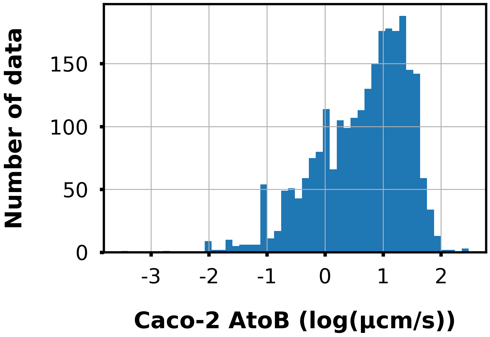

# Caco-2 permeability

## Task

- Regression

- Given a Morgan fingerprint(r=2, 2048 dim), predict the rate of apical-to-basal transport in Caco-2 cell.

## Dataset

- Data size: 2489

<div align="left">
    
</div>

## Model

- LightGBM regressor

- Hyperparameters were optimized in 5-folds cross-validation with Optuna.

- To train the model, run `train.py`.
    - Example usage
        ```bash
        python train.py -o lgb_caco-2
        ```

## Accuracy

|Corr Coef|R2|MAE|MSE|RMSE|
|:----:|:----:|:----:|:----:|:----:|
|0.70|0.49|0.40|0.30|0.55|

<div align="left">
      
</div>