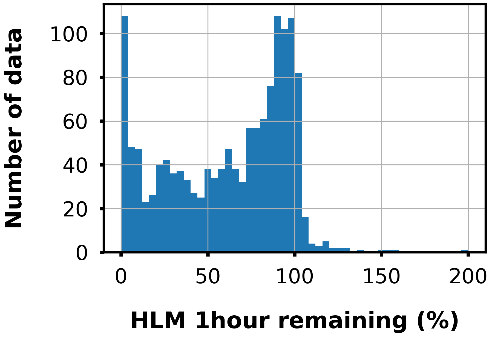
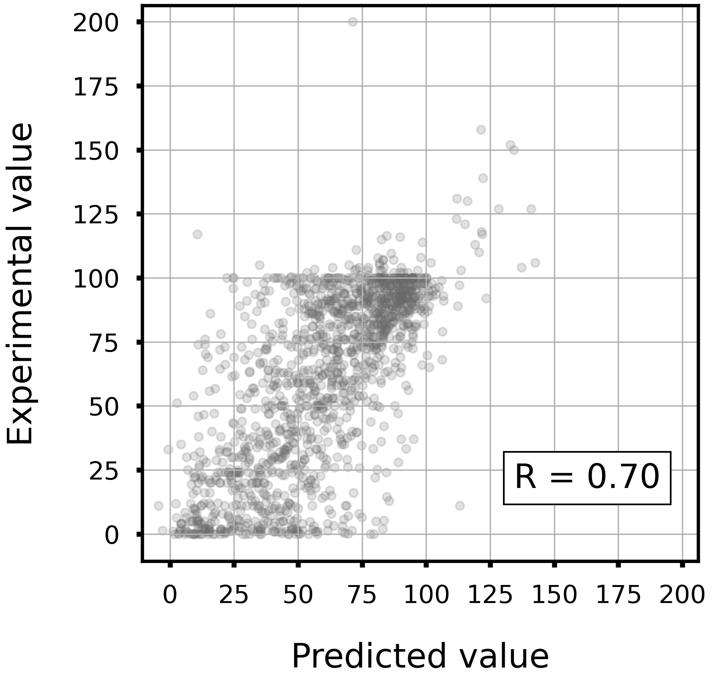
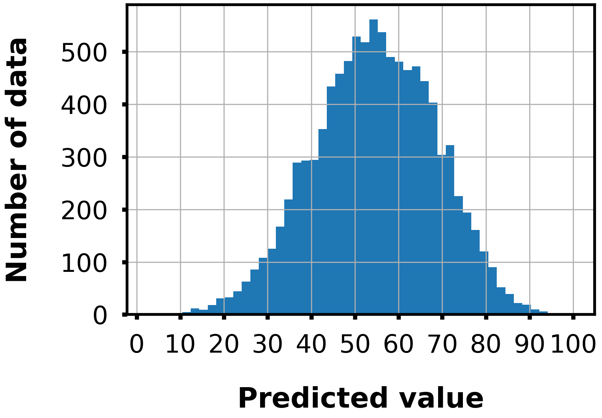

# Metabolic stability in human liver microsomes　(HLM).

## Task

- Regression

- Given a Morgan fingerprint(r=2, 2048 dim), predict the metabolic stability.

## Dataset

- Data size: 1480

<div align="left">
    
</div>

## Model

- LightGBM regressor

- Hyperparameters were optimized in 5-folds cross-validation with Optuna.

- To train the model, run `train.py`.
    - Example usage
        ```bash
        python train.py -o lgb_hlm
        ```

## LightGBM model performance

|Corr Coef|R2|MAE|MSE|RMSE|
|:----:|:----:|:----:|:----:|:----:|
|0.702|0.488|18.5|617|24.8|

<div align="left">
      
</div>

## Distribution of predicted values

The following figure shows the distribution of predicted values for 10,000 compounds randomly selected from the ZINC database.

<div align="left">
    
</div>