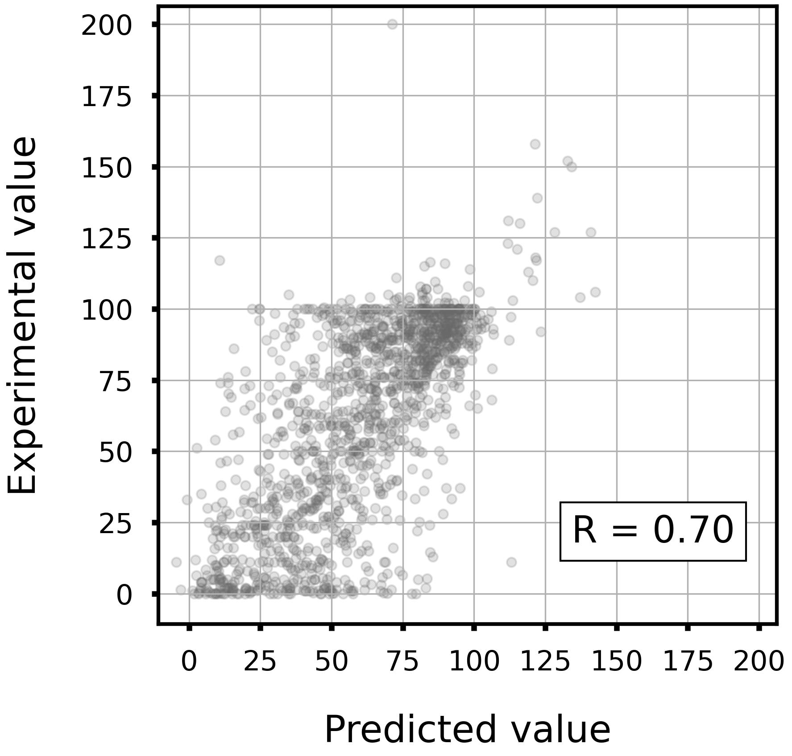

# Metabolic stability in human liver microsomes(HLM).

## Task

- Regression

- Given a Morgan fingerprint(r=2, 2048 dim), predict the metabolic stability.

## Dataset

- Data size: 1480

<div align="left">
    
</div>

## Model

- LightGBM regressor

- Hyperparameters were optimized in 5-folds cross-validation with Optuna.

- To train the model, run `train.py`.
    - Example usage
        ```bash
        python train.py -o lgb_hlm
        ```

## Accuracy

|Corr Coef|R2|MAE|MSE|RMSE|
|:----:|:----:|:----:|:----:|:----:|
|0.70|0.48|18.47|617.25|24.8|

<div align="left">
      
</div>