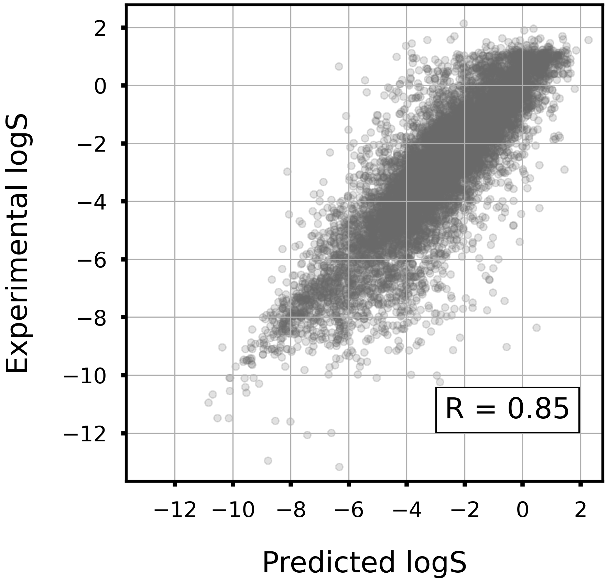
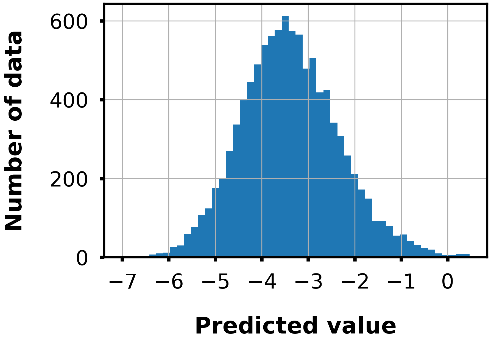

# Solubility, AqSolDB

## Description

>`Dataset Description`: Aqeuous solubility measures a drug's ability to dissolve in water. Poor water solubility could lead to slow drug absorptions, inadequate bioavailablity and even induce toxicity. More than 40% of new chemical entities are not soluble.  
>`Task Description`: Regression. Given a drug SMILES string, predict the activity of solubility.lipophilicity.  
>`Dataset Statistics`: 9,982 drugs.

## LightGBM model performance

|Corr Coef|R2|MAE|MSE|RMSE|
|:----:|:----:|:----:|:----:|:----:|
|0.85|0.72|0.88|1.53|1.23|

    

## Distribution of predicted values

The following figure shows the distribution of predicted values for 10,000 compounds randomly selected from the ZINC database.

    

## References

[1] Sorkun, M.C., Khetan, A. & Er, S. AqSolDB, a curated reference set of aqueous solubility and 2D descriptors for a diverse set of compounds. Sci Data 6, 143 (2019).

## Dataset License

CC BY 4.0.