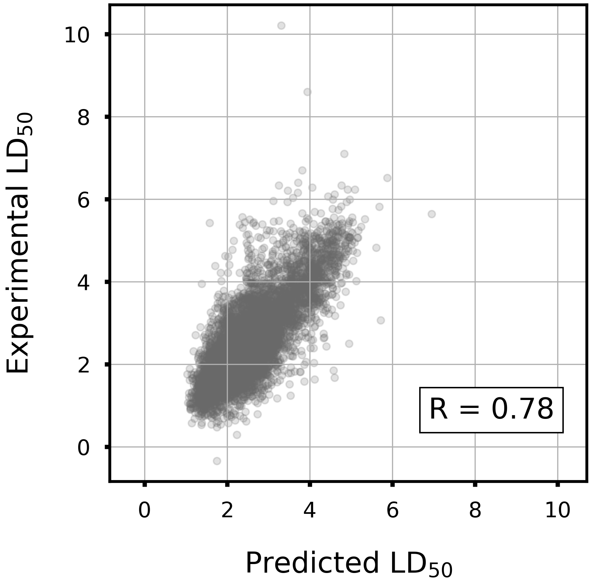

# Acute Toxicity LD50

## Description
Please see the following link for the details.  
https://tdcommons.ai/single_pred_tasks/tox/

>`Dataset Description`: Acute toxicity LD50 measures the most conservative dose that can lead to lethal adverse effects. The higher the dose, the more lethal of a drug. This dataset is kindly provided by the authors of [1].  
>`Task Description`: Regression. Given a drug SMILES string, predict its acute toxicity.  
>`Dataset Statistics`: 7,385 drugs.

## LightGBM model performance

|Corr Coef|R2|MAE|MSE|RMSE|
|:----:|:----:|:----:|:----:|:----:|
|0.77|0.60|0.43|0.36|0.60|

    

## Distribution of predicted values

The following figure shows the distribution of predicted values for 10,000 compounds randomly selected from the ZINC database.

    

## References

[1] Zhu, Hao, et al. “Quantitative structure− activity relationship modeling of rat acute toxicity by oral exposure.” Chemical research in toxicology 22.12 (2009): 1913-1921.

## Dataset License

>Not Specified. CC BY 4.0.
