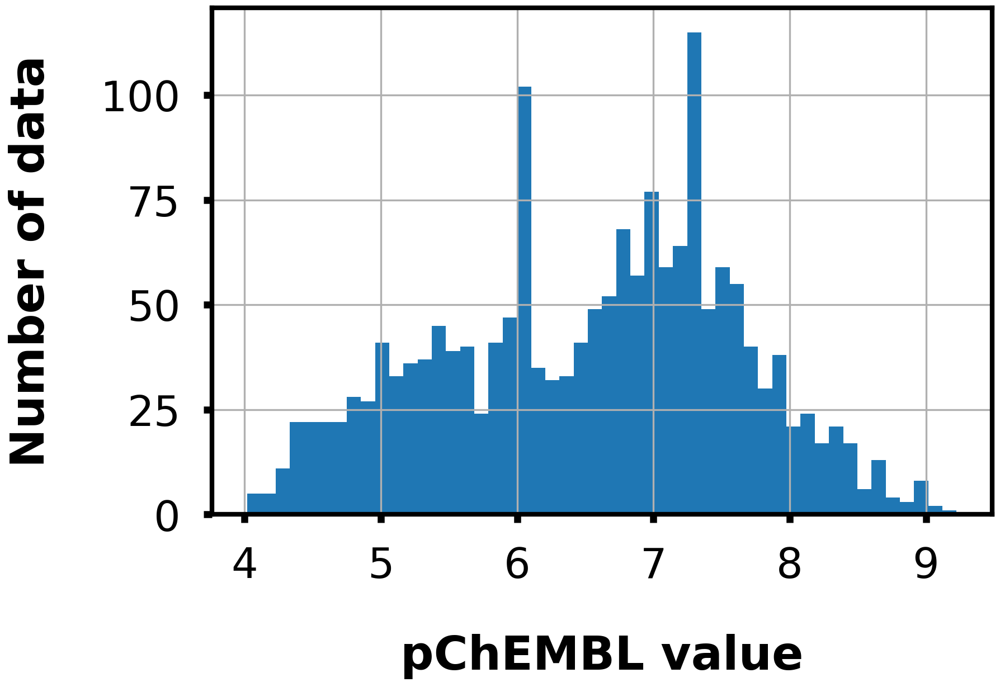
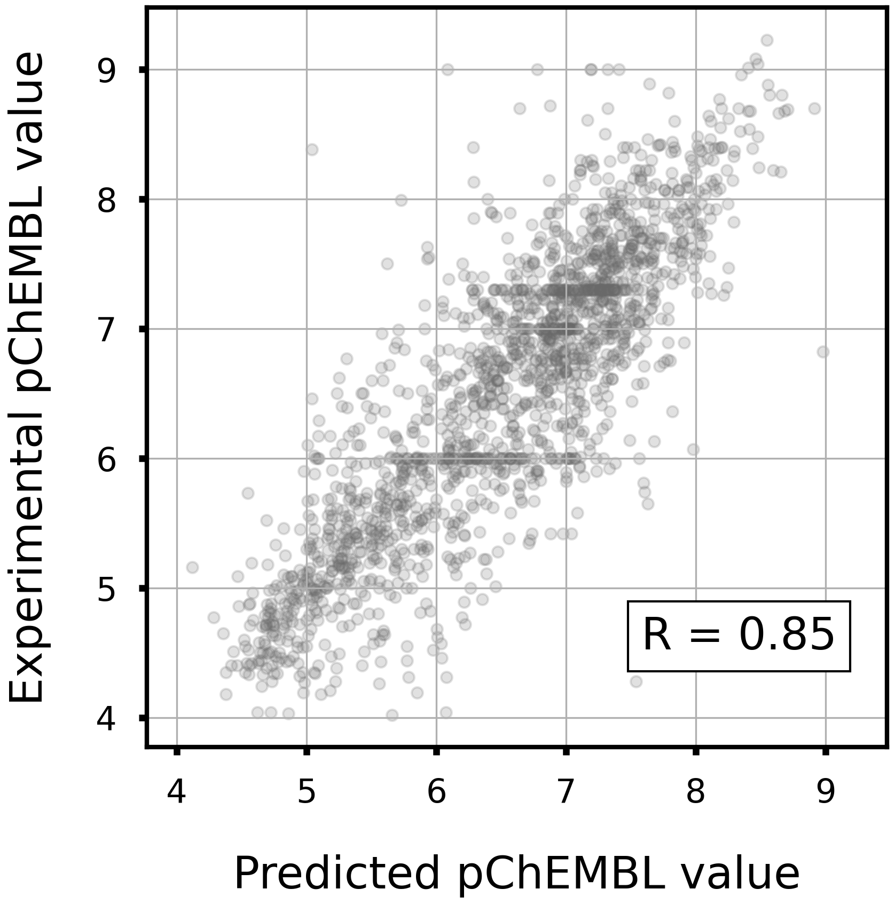
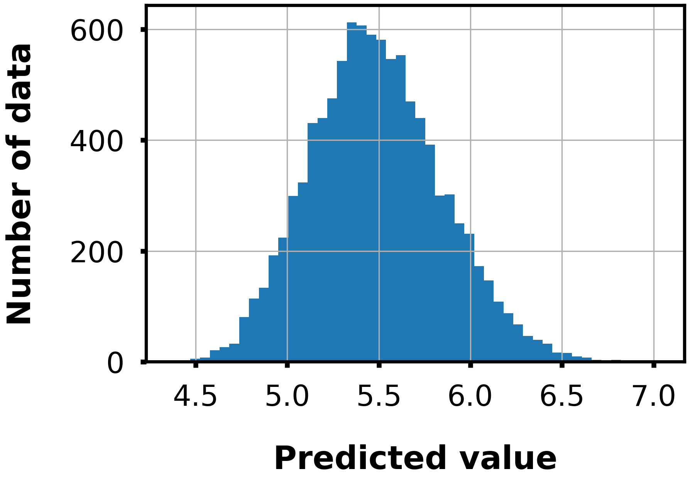

# Receptor protein-tyrosine kinase erbB-2

## Task

- Regression

- Given a Morgan fingerprint(r=2, 2048 dim), predict the pChEMBL value to erbB-2.

## Dataset

- Data size: 1739

<div align="left">
    
</div>

## Model

- LightGBM regressor

- Hyperparameters were optimized in 5-folds cross-validation with Optuna.

- To train the model, run `train.py`.
    - Example usage
        ```bash
        python train.py -o lgb_erbb2
        ```

## Accuracy

|Corr Coef|R2|MAE|MSE|RMSE|
|:----:|:----:|:----:|:----:|:----:|
|0.85|0.71|0.43|0.34|0.58|

<div align="left">
      
</div>

## Distribution of predicted values

The following figure shows the distribution of predicted values for 10000 compounds randomly selected from the ZINC database.

<div align="left">
    
</div>
