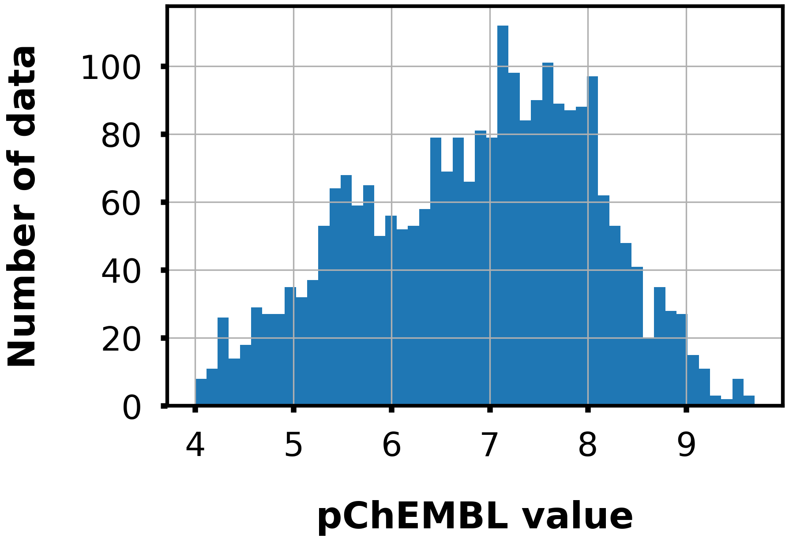
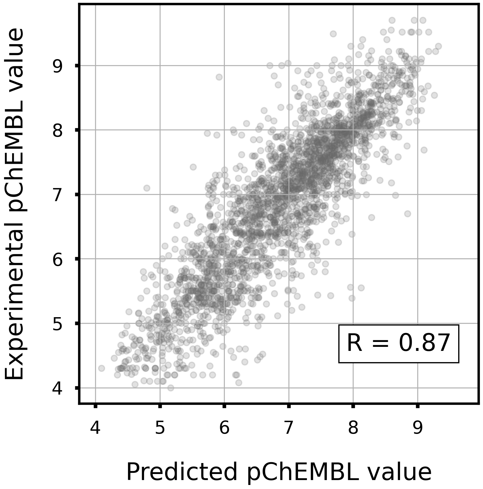
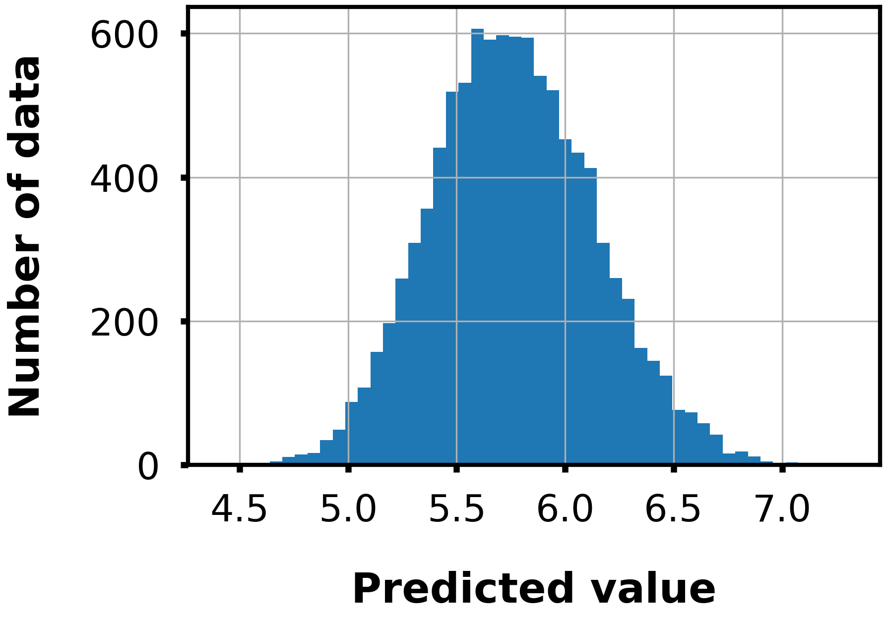

# Fibroblast growth factor receptor 1

## Task

- Regression

- Given a Morgan fingerprint(r=2, 2048 dim), predict the pChEMBL value to FGFR1.

## Dataset

- Data size: 2497

<div align="left">
    
</div>

## Model

- LightGBM regressor

- Hyperparameters were optimized in 5-folds cross-validation with Optuna.

- To train the model, run `train.py`.
    - Example usage
        ```bash
        python train.py -o lgb_fgfr1
        ```

## LightGBM model performance

|Corr Coef|R2|MAE|MSE|RMSE|
|:----:|:----:|:----:|:----:|:----:|
|0.87|0.75|0.44|0.35|0.59|

<div align="left">
      
</div>

## Distribution of predicted values

The following figure shows the distribution of predicted values for 10000 compounds randomly selected from the ZINC database.

<div align="left">
    
</div>
