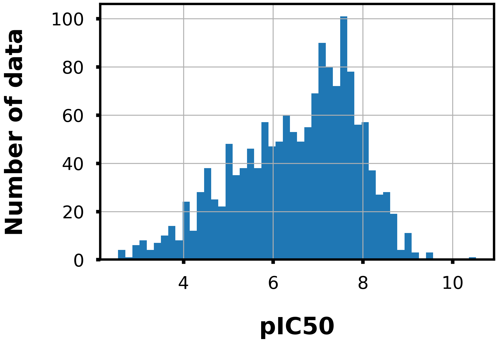
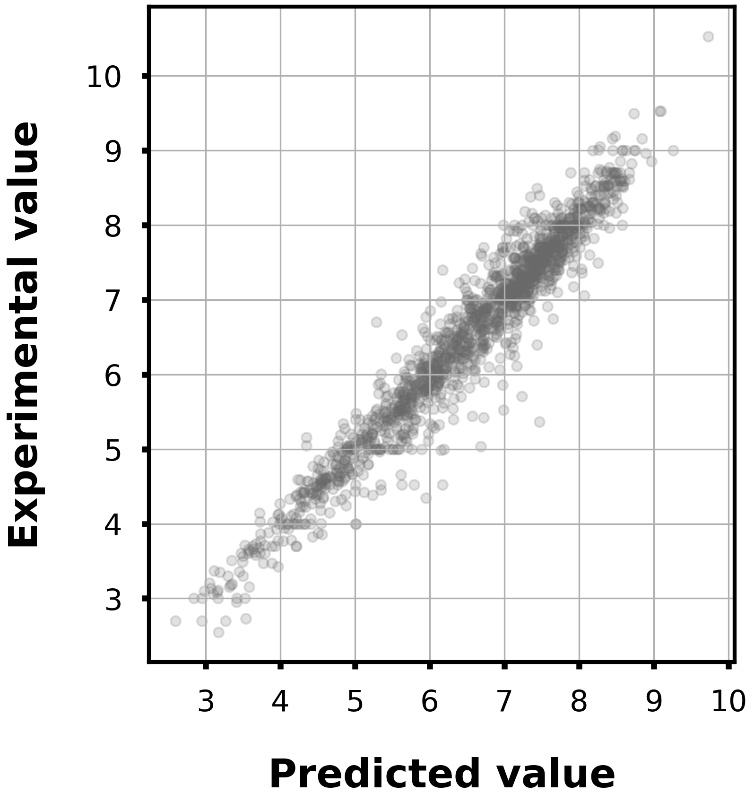

# aspartyl protease b-site APP cleaving enzyme-1 (BACE1)

## Task

- Regression

- Given a Morgan fingerprint(r=2, 2048 dim), predict the pIC50 value to BACE1.

## Dataset

- Please see the following link for the details.
https://github.com/deepchem/deepchem/tree/master/examples/bace

- Data size: 1522

<div align="left">
    
</div>

## Model

- LightGBM regressor

- Hyperparameters were optimized in 5-folds cross-validation with Optuna.

- To train the model, run `train.py`.
    - Example usage
        ```bash
        python train.py -o lgb_bace1
        ```

## Accuracy

|Corr Coef|R2|MAE|MSE|RMSE|
|:----:|:----:|:----:|:----:|:----:|
|0.86|0.74|0.49|0.45|0.67|

<div align="left">
      
</div>