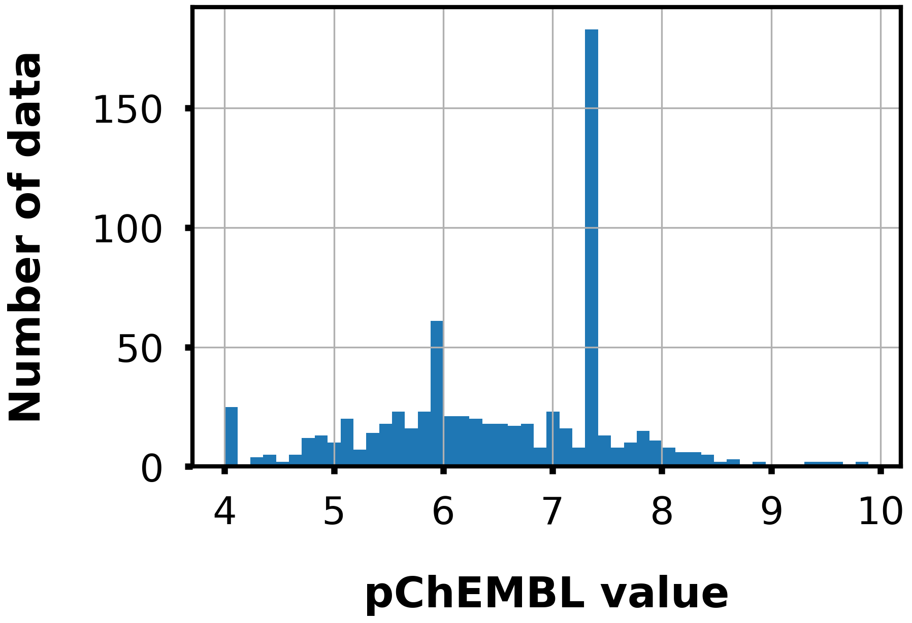
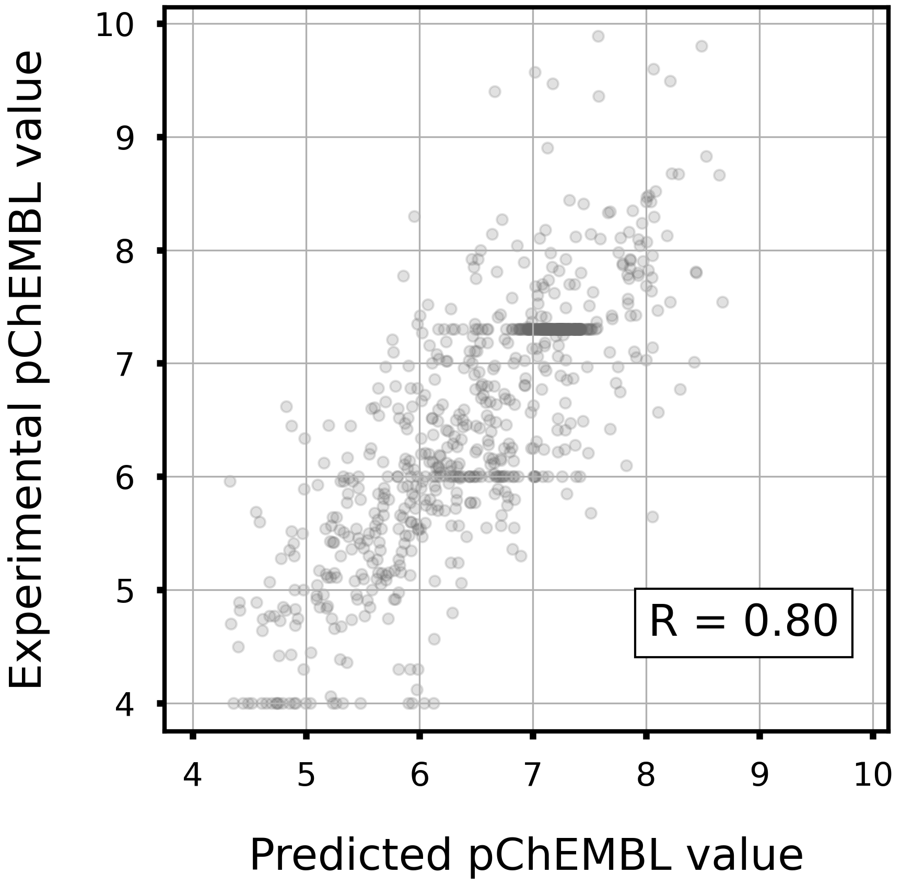

# Ephrin type-B receptor 4

## Task

- Regression

- Given a Morgan fingerprint(r=2, 2048 dim), predict the pChEMBL value to EPHB4.

## Dataset

- Data size: 727

<div align="left">
    
</div>

## Model

- LightGBM regressor

- Hyperparameters were optimized in 5-folds cross-validation with Optuna.

- To train the model, run `train.py`.
    - Example usage
        ```bash
        python train.py -o lgb_ephb4
        ```

## Accuracy

|Corr Coef|R2|MAE|MSE|RMSE|
|:----:|:----:|:----:|:----:|:----:|
|0.79|0.63|0.48|0.44|0.66|

<div align="left">
      
</div>
