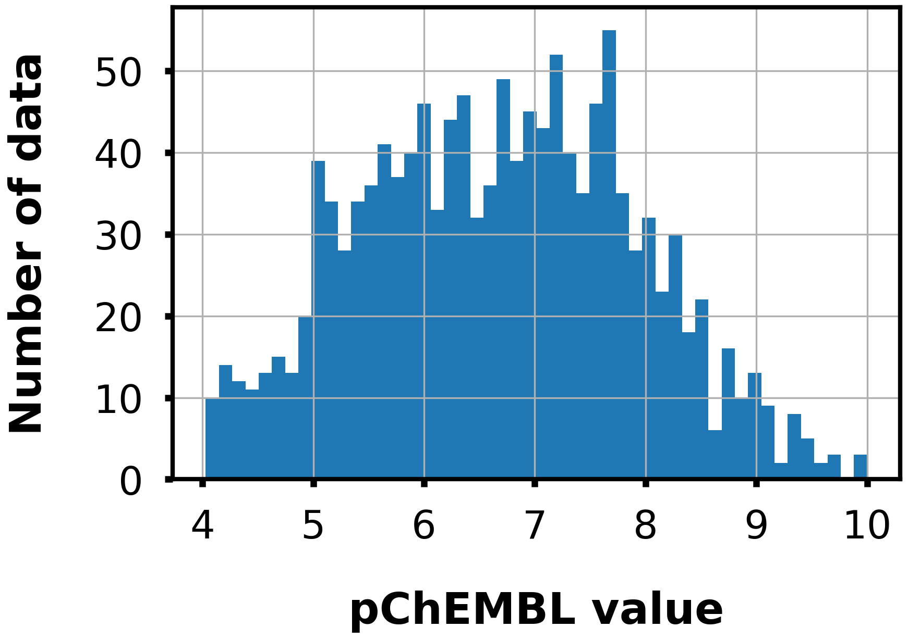
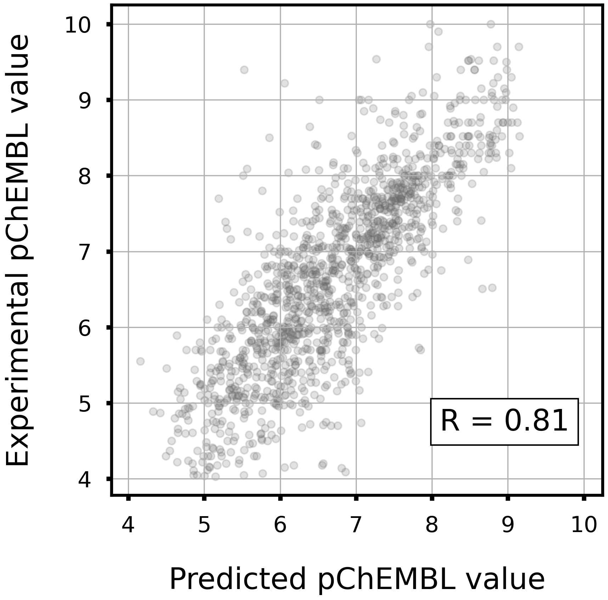
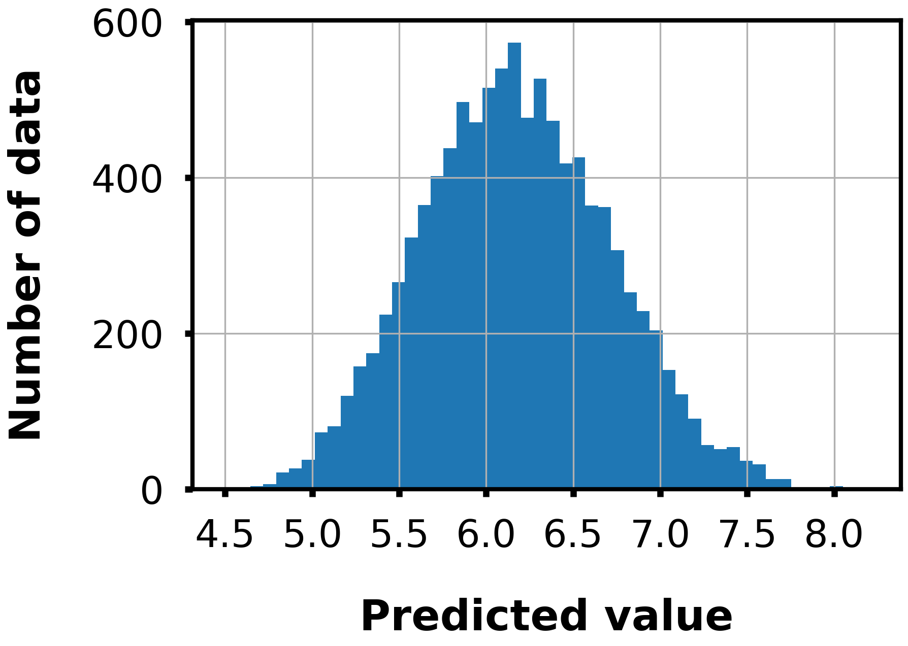

# Platelet-derived growth factor receptor beta

## Task

- Regression

- Given a Morgan fingerprint(r=2, 2048 dim), predict the pChEMBL value to PDGFRbeta.

## Dataset

- Data size: 1304

<div align="left">
    
</div>

## Model

- LightGBM regressor

- Hyperparameters were optimized in 5-folds cross-validation with Optuna.

- To train the model, run `train.py`.
    - Example usage
        ```bash
        python train.py -o lgb_pdgfrbeta
        ```

## Accuracy

|Corr Coef|R2|MAE|MSE|RMSE|
|:----:|:----:|:----:|:----:|:----:|
|0.80|0.64|0.54|0.52|0.72|

<div align="left">
      
</div>

## Distribution of predicted values

The following figure shows the distribution of predicted values for 10000 compounds randomly selected from the ZINC database.

<div align="left">
    
</div>
